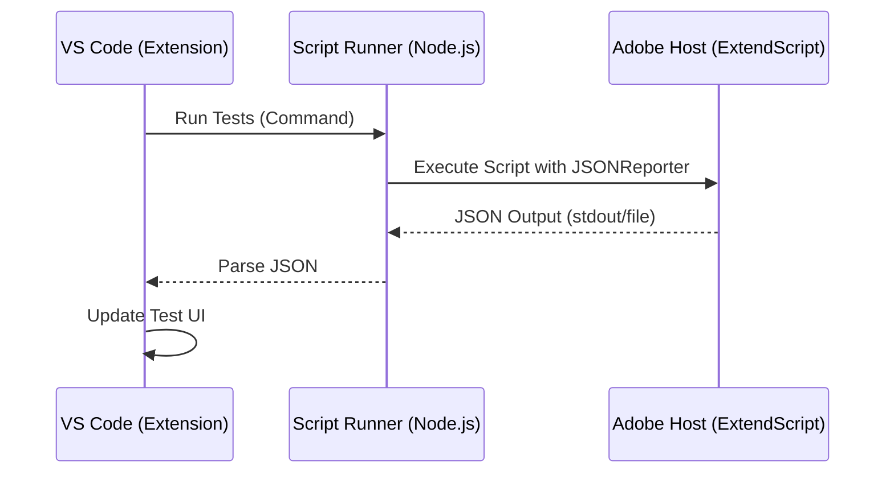

# VS Code Extension Development Guide

## Reference

**Core Library Repository**: [https://github.com/Octopodo/kt-testing-suite-core](https://github.com/Octopodo/kt-testing-suite-core)

This suite is an Adobe ExtendScript testing framework similar to Jest/Mocha. The extension will integrate this suite into VS Code's native Testing API.

---

# Roadmap

## Architecture

The extension will act as a bridge between the VS Code UI and the ExtendScript testing process.



## Phase 1: Project Scaffolding

1.  **Generate Extension**: Use `yo code` to generate a generic TypeScript extension.
2.  **Define Activation Events**: Configure `package.json` to activate on relevant files (e.g., `*.test.ts`, `*.spec.ts`).

## Phase 2: Test Discovery (The "Dry Run")

VS Code needs to show the list of tests _before_ running them.

1.  **Implement Discovery Strategy**:
    - _Option A (Regex)_: Fast, static analysis of file text to find `describe` and `it`. (Easier to start).
    - _Option B (Runtime)_: Run the test scripts in a "dry-run" mode where `describe`/`it` only register tests but don't execute `fn`. (More accurate but requires spinning up the host).
2.  **Test Controller**: Implement `vscode.tests.createTestController` to manage the UI tree.

## Phase 3: The Runtime Bridge

1.  **Command Execution**: The extension needs to know _how_ to run your tests.
2.  **Wrapper Logic (Manual Global Strategy)**:
    - Since the library **no longer exposes globals automtically** (to avoid pollution), the Extension Wrapper has two choices:
      - **A) Parse stdout**: Just run the user script and parse the console output (simplest, no globals needed).
      - **B) Double Run (Robust JSON)**: Include the script, then run it again with `JSONReporter`.

        - _Requirement_: The user's script must manually expose `runTests` to `$.global` OR the wrapper must try to find it.
        - _Snippet_:

        ```javascript
        // #include "path/to/user/test.js"

        // IF the user exposed it:
        if (typeof runTests !== "undefined") {
          runTests(undefined, new JSONReporter("path/to/results.json"));
        }
        ```
3.  **JSON Parsing**: The extension consumes the output.

## Phase 4: Interactive Debugging (Advanced)

1.  **Attach Debugger**: Integrate with the `ExtendScript Debugger` extension to allow hitting breakpoints inside tests.

## Recommended Next Step

Start by creating a basic extension that can:

1.  Activate.
2.  Discover tests using simple Regex (Phase 2, Option A).
3.  Print the "Run" command to the console (Phase 3 placeholder).

---

# Security Considerations

When publishing an extension, especially one that executes code (like a Test Runner), security is paramount.

## 1. Workspace Trust

Since your extension executes code (`npm run test`, ExtendScript), it **cannot** function safely in an untrusted workspace (e.g., a folder downloaded from the internet that the user hasn't verified).

- **Action**: In `package.json`, set `"capabilities": { "untrustedWorkspaces": { "supported": false } }`.
- **Reason**: Prevents your extension from automatically running malicious scripts simply by opening a folder.

## 2. Command Injection Prevention

Your extension will spawn child processes to run the test builder.

- **Risk**: If a malicious user configures a path like `"kt.testRunnerPath": "; rm -rf /"`.
- **Mitigation**:
  - Do **not** concatenate strings to build commands.
  - Use `child_process.spawn` with an array of arguments, not `exec` with a shell string.
  - Validate all configuration values (paths, args) before use.

## 3. Path Traversal

- **Risk**: Reading files outside the workspace.
- **Mitigation**: Always resolve file paths relative to `vscode.workspace.workspaceFolders`. Reject paths containing `..` that try to escape the workspace root.

## 4. Webview Content Security Policy (CSP)

If you build a custom reporter UI using a Webview:

- **Action**: Define a strict `<meta http-equiv="Content-Security-Policy">` header.
- **Rule**: Disable `unsafe-inline` scripts and styles. Only load resources from the extension directory.

## 5. Dependency Supply Chain

- **Action**: Use `npm audit` regularly.
- **Action**: Minimize runtime dependencies. `devDependencies` are fine, but huge dependency trees in `dependencies` increase the attack surface.

## 6. Secrets Management

- **Scenario**: If you ever need to store API keys or passwords.
- **Action**: NEVER use `workspaceConfig` or local files. Use the `vscode.SecretStorage` API.

## Checklist for Publication

- [ ] Enable `untrustedWorkspaces: false` support.
- [ ] Audit dependencies (`npm audit`).
- [ ] specific validation for any user-controlled command arguments.
- [ ] Review `README.md` to not expose sensitive info if you include screenshots.
